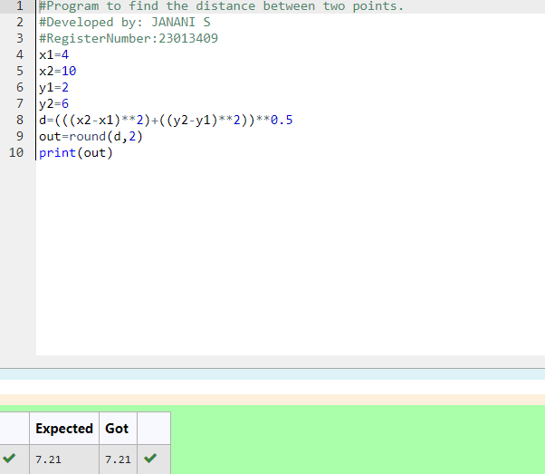

# DISTANCE-BETWEEN-TWO-POINTS

## AIM:
To write a python program to find the distance two 2 points
## ALGORITHM:
### Step 1: 
Get the values from the user
### Step 2: 
Assign the value of variable to a temporary variable
### Step 3: 
Substitute the values in the distance formula  
### Step 4: 
Using the slicing concept rotate the list
### Step 5: 
Print both the values it would be interchanged
### PROGRAM:
```
#Program to find the distance between two points.
#Developed by: JANANI S
#RegisterNumber:23013409
x1=4
x2=10s
y1=2
y2=6
d=(((x2-x1)**2)+((y2-y1)**2))**0.5
out=round(d,2)
print(out)
```
### OUTPUT:



### RESULT:
The output for distance between two points is successfull.
